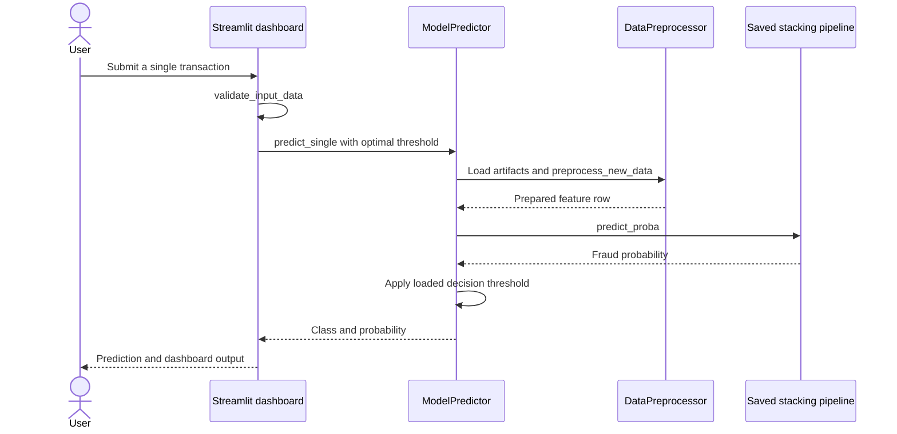
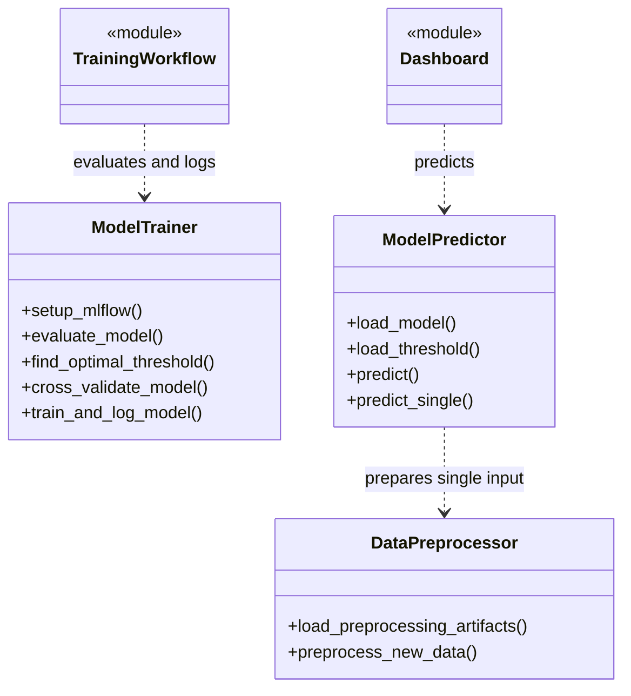

# GTC Fraud Detection

A structured credit-card fraud detection project with feature engineering, a stacking ensemble, saved inference artifacts, and a Streamlit dashboard.

**Technology:** Python · XGBoost · LightGBM · CatBoost · imbalanced-learn · Streamlit

## Features

- Train a pipeline with median imputation, SMOTE, and a stacking classifier.
- Combine XGBoost, CatBoost, and LightGBM base learners with Logistic Regression as the final estimator.
- Load preprocessing artifacts, a saved model pipeline, and an operating threshold for inference.
- Explore single transactions, batch inputs, and dashboard monitoring; generated sample transactions are demonstrations.

## Repository guide

| Path | Purpose |
|---|---|
| [src/models/train_model.py](src/models/train_model.py) | Training workflow and artifact export. |
| [src/utils/data_preprocessing.py](src/utils/data_preprocessing.py) | Input validation and preprocessing. |
| [src/utils/feature_engineering.py](src/utils/feature_engineering.py) | Feature transformations. |
| [src/utils/model_utils.py](src/utils/model_utils.py) | Model training and inference helpers. |
| [src/deployment/app.py](src/deployment/app.py) | Streamlit dashboard. |
| [artifacts](artifacts) | Committed model and preprocessing assets. |
| [notebooks](notebooks) | Exploratory training notebooks. |

## Requirements and current limitations

The raw training dataset is not included. Keep the full artifact set together and use the pinned library versions when loading the saved pipeline. Scores and sample dashboard records do not establish real-world fraud detection performance. The source imports MLflow, Matplotlib, and Seaborn, which are absent from the committed requirements list; the supplemental install command supplies them.

## UML diagrams

### Main workflow

For a single transaction, ModelPredictor loads preprocessing artifacts, calls the saved pipeline, and applies its operating threshold to the returned probability.



### Inference and training helpers

The utility classes separate training/evaluation from model loading and prediction; the diagram shows responsibilities rather than an inheritance relationship.



## Getting started

```bash
git clone https://github.com/IbrahimAbdelsattar/GTC-Fraud-Detection.git
cd GTC-Fraud-Detection
```

Use a Python virtual environment:

```bash
python -m venv .venv
```

Activate it with `source .venv/bin/activate` on macOS/Linux or `.venv\Scripts\Activate.ps1` in PowerShell.

```bash
python -m pip install -r requirements.txt
python -m pip install -e .
python -m pip install mlflow matplotlib seaborn
python -m streamlit run src/deployment/app.py
```

## Training

Place the training CSV at `data/raw/creditcard.csv`, as configured in `src/config/parameters.py`, then run from the repository root:

```bash
python -m src.models.train_model
```

Training writes model and preprocessing artifacts. Review the saved feature order and threshold before using newly trained models.

## Docker

```bash
docker build -t gtc-fraud-detection .
docker run --rm -p 7860:7860 gtc-fraud-detection
```

The Dockerfile serves Streamlit on port `7860`.

## Project notes

Project contributors listed in `setup.py`: Ibrahim Abdelsattar, Mohamed Abdelghany, Yousef Abdelhady, Yusuf Kamel, Mohamed Hamed, and Omar Hosni.
